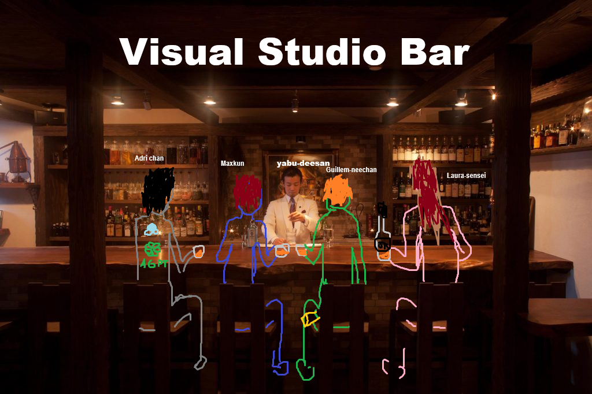
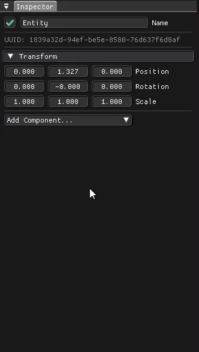

# LoopieEngine - Group 3: Particle System

## Introduction:
This particle system was made for and is using Loopie Engine, created by our classmates, for the Engines subject at CITM - UPC.

## Team Members:
  - Max Mateo: [M4xp0w3rg4m3s](https://github.com/M4xp0w3rg4m3s)
  - Guillem Martínez: [Guillem](https://github.com/GuillemDev)
  - Laura Parras: [AuriChan](https://github.com/AuriChan)

  Individual work of each member for this assignment: [Task list](https://docs.google.com/spreadsheets/d/1DxJJNrGyl3e8Y_Y7BiQFrCry8LNaki0DlMGY7sra-K8/edit?usp=sharing)

## Team Photo:

  

## Particle System:
Our Particle System is based on the component ParticlesComponent. The Particle component holds a vector of EmitterInstances, which are tasked with keeping all necessary configurations, as well as the mesh, texture, and material needed to generate particles in the way determined by those configurations. When importing or exporting, we consider an array of emitters, each with its own configuration, stored in JSON format. If the user wants to modify any of the values, the component can be accessed through the inspector when selecting the entity owning it, allowing the user to modify any of the emitters in it.

  

## GitHub Repository:
[LoopieEngine-ParticleSystem-Group3](https://github.com/GuillemDev/LoopieEngine-ParticleSystem-Group3)

## Final Release:
[GitHub Release](https://github.com/GuillemDev/LoopieEngine-ParticleSystem-Group3/releases/tag/Particle-system)

## Conclusion:
We are not quite satisfied with how the delivery turned out and with the job done for this assignment. We have reached a deadlock, due to a lack of time and knowledge, when it comes to rendering particles, the most important part of the system. We also haven't been able to dedicate as much time to it as we would have liked, due to the number of final deadlines we had in the last few days. Because of all this, it has been impossible for us to deliver something as complete and well-done as we would have liked, and we are not really proud of the result. We are sorry about that.

  

